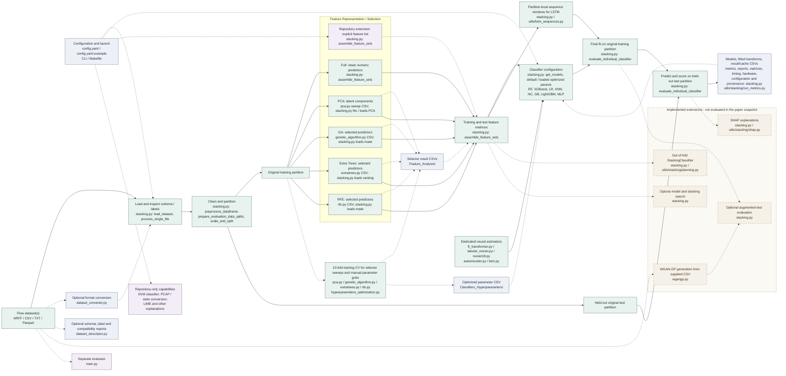

<div align="center">

# [DDoS-Detector.](https://github.com/BrenoFariasdaSilva/DDoS-Detector)

</div>

<div align="center">

---

Machine-learning research framework for DDoS detection and multi-class attack classification on tabular network-flow datasets. The current repository provides dataset conversion and description tools, feature-selection workflows, classifier hyperparameter search, WGAN-GP data augmentation, stacking/AutoML evaluation, caching/resume support, runtime metrics, hardware metadata, explainability hooks, and optional Telegram notifications.

The current headline empirical result is from the CICDDoS2019 `01-12` combined-files multi-class Run 1 stacking cache: **0.894754 F1-Score** and **0.907271 Accuracy** with **LSTM + RFE Features + Default Hyperparameters** across 13 classes. Detailed results are in [RESULTS.md](RESULTS.md).

---

</div>

<div align="center">


</div>

## Table of Contents

- [DDoS-Detector.](#ddos-detector)
  - [Table of Contents](#table-of-contents)
  - [Introduction](#introduction)
  - [Architecture](#architecture)
    - [Methodology-to-Code Workflow](#methodology-to-code-workflow)
  - [Capabilities](#capabilities)
  - [Supported Classifiers](#supported-classifiers)
  - [Setup](#setup)
    - [Git](#git)
        - [Linux](#linux)
        - [macOS](#macos)
        - [Windows](#windows)
    - [Clone the Repository](#clone-the-repository)
    - [Python, Pip and Venv](#python-pip-and-venv)
      - [Linux](#linux-1)
      - [macOS](#macos-1)
      - [Windows](#windows-1)
    - [Make](#make)
      - [Linux](#linux-2)
      - [macOS](#macos-2)
      - [Windows](#windows-2)
    - [Dependencies/Requirements](#dependenciesrequirements)
  - [Usage](#usage)
  - [Results](#results)
  - [How to Cite?](#how-to-cite)
  - [Contributing](#contributing)
  - [Collaborators](#collaborators)
  - [License](#license)
    - [Apache License 2.0](#apache-license-20)

## Introduction

DDoS-Detector is a modular Python framework for evaluating DDoS detection pipelines on flow-based datasets such as CICDDoS2019 and CIC-IDS-2017. It focuses on reproducible experiments: CSV outputs include metrics, feature-set identity, runtime fields, and hardware metadata where supported by the executing module.

Configuration is centralized in `config.yaml`, with script defaults and CLI flags as fallbacks or overrides. `config.yaml.example` mirrors the same structure for portable setup.

## Architecture

This diagram maps the paper's dataset-configurable methodology to the current code. Solid arrows follow the original-data experiment path; dashed arrows show optional tools, artifact handoffs, or software extensions. The separate dashed box contains implemented capabilities excluded from the paper's evaluated 99-configuration snapshot. Repository inputs and evaluation modes can exceed the paper's ARFF/CSV/TXT/Parquet contract.

### Methodology-to-Code Workflow



**Reading the arrows:** Solid arrows are the conceptual original-data path, not direct Python imports. Dashed arrows are optional execution paths, artifact handoffs, or configuration inputs. The standalone feature scripts write selector results under `Feature_Analysis/`; `stacking.py` reads GA/RFE/Extra Trees feature names and the PCA component count, then fits or reuses its *own* PCA transformer on the training partition. It applies each representation to the matching test matrix without fitting the scaler or PCA on that held-out partition. An explicit feature list is supported by the repository, outside the five paper representations. By default, trained artifacts are stored under dataset-local `Stacking/Models/`, run caches and per-run report bundles under `Stacking/Cache_Results/`, and result CSVs under `Feature_Analysis/` or the configured stacking output directory.

The 10-fold CV in this diagram belongs to standalone selection and manual hyperparameter search (the latter uses GA-selected features); the ordinary `stacking.py` individual-classifier grid performs a final fit and held-out evaluation, despite storing a `cv_method` description. Its optional `StackingClassifier` has its own 10-fold out-of-fold training, and AutoML uses configurable CV (five folds by default). Selector CSVs are separate studies: for example, the PCA component chooser can rank rows by `test_f1_score`, so the code does **not** prove a fully nested, training-only model-selection procedure. In `hyperparameters_optimization.py`, scaling also precedes the CV folds, so its fold scores do not establish fold-local preprocessing. `stacking.py` also removes zero-variance columns before the split and drops nonnumeric predictors rather than encoding them; its label encoder, scaler, and PCA fit are training-partition scoped.

The paper's dashed block describes **training-only** WGAN-GP augmentation. The current `wgangp.py` trains on the supplied CSV, without making its own train/test split; pass it a pre-isolated training CSV to enforce that boundary. The optional `stacking.py` integration evaluates original-trained models on generated samples as an augmented **test** path, rather than adding generated rows to the original training partition. Neither path contributed to the 99 original-only configurations in [RESULTS.md](RESULTS.md). The same exclusion applies to stacking, AutoML, and SHAP; SVM and explicit features are other repository capabilities outside that snapshot.

`dataset_descriptor.py` is an optional diagnostic tool, and `main.py` is a separate evaluator; neither is called by the `stacking.py` paper-trace path. The configured dataset paths are examples, not a CICDDoS2019 requirement. Reusing a trained model or feature mask on another dataset requires matching predictor and label semantics; configurable ingestion alone does not establish cross-dataset transfer.

Ancillary modules: `training_progress.py` and `classifier_eta.py` report progress and estimates; `utils/stacking/planning.py` builds experiment plans; `utils/stacking/run_metrics.py` aggregates run caches; `utils/stacking/shap.py` implements SHAP helpers. `Makefile` launches scripts independently.

## Capabilities

- Dataset conversion: `dataset_converter.py` recursively converts ARFF, CSV, Parquet, TXT, PCAP, and stats inputs to ARFF, CSV, Parquet, or TXT outputs under `Converted/`.
- Dataset description: `dataset_descriptor.py` writes dataset summaries under `Dataset_Description/`, optional preprocessing summaries, class distributions, feature statistics, t-SNE plots, and cross-dataset compatibility reports.
- Feature selection: Full Features, PCA Components, RFE Features, GA Features, Extra Trees Features, and explicit feature lists are supported by `stacking.py`; standalone feature-selection scripts export their own CSV artifacts.
- Hyperparameter optimization: `hyperparameters_optimization.py` performs manual grid search over GA-selected features and writes `Classifiers_Hyperparameters/Hyperparameter_Optimization_Results.csv`; `stacking.py` can load optimized parameters for default-versus-optimized evaluation.
- AutoML: `stacking.py` uses Optuna for model search and stacking-configuration search. This is hyperparameter/model selection, not a general AutoML system for arbitrary pipelines.
- Stacking: `stacking.py` can evaluate individual classifiers and `StackingClassifier`; the default stacking meta-estimator is Random Forest, excluding SVM from base estimators.
- Execution modes: `stacking.py` supports `separate_files`, `combined_files`, and `both`. Combined-files mode merges directory CSVs and treats each attack label as a distinct multi-class target.
- Cache/resume: stacking cache rows are keyed by execution mode, data source, experiment mode, augmentation ratio, attack set, feature set, classifier, hyperparameter mode, and experiment run. Repeated runs and cached reruns are exposed through CLI flags.
- Runtime controls: stacking supports skip/only combination rules, optional pending-sort by prior elapsed time, feature-set worker controls, low-memory mode, memory watcher diagnostics, and automatic OOM restart with exact skip rules.
- Explainability: `stacking.py` includes SHAP, LIME, permutation importance, feature importance, PDP, ICE, and surrogate-model toggles under the `explainability` config section.
- Data augmentation: `wgangp.py` implements conditional WGAN-GP generation for tabular flow features, with checkpoints, generated CSV output, and optional augmented-test evaluation in `stacking.py`.
- Notifications: scripts integrate optional sound and Telegram notifications; `stacking.py` also starts an inbound Telegram listener for validated runtime control messages when configured.

## Supported Classifiers

`stacking.py` can instantiate these classifiers from current source/configuration:

- Conventional ML: Random Forest, SVM, XGBoost, Logistic Regression, KNN, Nearest Centroid, Gradient Boosting, LightGBM.
- Neural/deep tabular models: MLP (Neural Net), FT-Transformer, Tabular ResNet, ResNet18, AutoEncoder, LSTM.
- Ensemble: scikit-learn `StackingClassifier`.

`hyperparameters_optimization.py` currently optimizes Random Forest, SVM, XGBoost, Logistic Regression, KNN, Nearest Centroid, Gradient Boosting, LightGBM, and MLP (Neural Net). `stacking.py` AutoML search spaces also include Extra Trees and Decision Tree, with neural search spaces added when those neural classifiers are enabled.

## Setup

This section provides instructions for installing Git, Python, Pip, Make, then to clone the repository (if not done yet) and all required project dependencies. 

### Git

`git` is a distributed version control system that is widely used for tracking changes in source code during software development. In this project, `git` is used to download and manage the analyzed repositories, as well as to clone the project and its submodules. To install `git`, follow the instructions below based on your operating system:

##### Linux

To install `git` on Linux, run:

```bash
sudo apt install git -y # For Debian-based distributions (e.g., Ubuntu)
```

##### macOS

If you don't have Homebrew installed, you can install it by running the following command in your terminal:

```bash
/bin/bash -c "$(curl -fsSL https://raw.githubusercontent.com/Homebrew/install/HEAD/install.sh)"
```

To install `git` on MacOS, you can use Homebrew:

```bash
brew install git
```

##### Windows

On Windows, you can download `git` from the official website [here](https://git-scm.com/downloads) and follow the installation instructions provided there.

### Clone the Repository

Now that git is installed, it's time to clone this repository with all required submodules, use:

``` bash
git clone --recurse-submodules https://github.com/BrenoFariasdaSilva/DDoS-Detector.git
```

If you clone without submodules (not recommended):

``` bash
git clone https://github.com/BrenoFariasdaSilva/DDoS-Detector
cd DDoS-Detector
```

To initialize submodules manually:

``` bash
git submodule init
git submodule update
```

### Python, Pip and Venv

You must have Python 3, Pip, and the `venv` module installed.

#### Linux

``` bash
sudo apt install python3 python3-pip python3-venv -y
```

#### macOS

``` bash
brew install python3
```

#### Windows

If you do not have Chocolatey installed, you can install it by running the following command in an **elevated PowerShell (Run as Administrator)**:

```powershell
Set-ExecutionPolicy Bypass -Scope Process -Force; [System.Net.ServicePointManager]::SecurityProtocol = [System.Net.ServicePointManager]::SecurityProtocol -bor 3072; iex ((New-Object System.Net.WebClient).DownloadString('https://community.chocolatey.org/install.ps1'))
```

Once Chocolatey is installed, you can install Python using:

``` bash
choco install python3
```

Or download the installer from the official website [here](https://www.python.org/downloads/windows/) and follow the installation instructions provided there. Make sure to check the option "Add Python to PATH" during installation ans restart your terminal/computer.

### Make 

`Make` is used to run automated tasks defined in the project's Makefile, such as setting up environments, executing scripts, and managing Python dependencies.

#### Linux

``` bash
sudo apt install make -y
```

#### macOS

``` bash
brew install make
```

#### Windows

Available via Cygwin, MSYS2, or WSL.

### Dependencies/Requirements

1. Install the project dependencies with the following command:

   ```bash
   cd DDoS-Detector # Only if not in the repository root directory yet
   make dependencies
   ```

   This command will create a virtual environment in the `.venv` folder and install all required dependencies listed in the `requirements.txt` file.

Download supported benchmark datasets:

```bash
make download_datasets
```

`download_datasets.sh` currently downloads CICDDoS2019 (`CSV-01-12.zip`, `CSV-03-11.zip`) into `Datasets/CICDDoS2019` and CIC-IDS-2017 labelled flows into `Datasets/CICIDS2017`, using `wget` and `unzip`.

Manual dataset layout example:

```text
Datasets/
  CICDDoS2019/
    01-12/
    03-11/
  CICIDS2017/
    TrafficLabelling/
```

## Usage

Make targets verified against the current `Makefile`:

```bash
make dataset_converter
make dataset_descriptor
make genetic_algorithm
make extratrees
make pca
make rfe
make hyperparameters_optimization
make stacking
make stacking ARGS="--combined-files --dataset-path ./Datasets/CICDDoS2019/01-12 --disable-augmentation --disable-automl"
make stacking-full
make wgangp CSV_PATH=./Datasets/CICDDoS2019/01-12/DrDoS_DNS.csv MODE=train EPOCHS=60
```

Useful `stacking.py` CLI controls include `--combined-files`, `--separate-files`, `--both`, `--feature-sets full,pca,rfe,ga,extra_trees`, `--enable-hyperparameters`, `--disable-hyperparameters`, `--enable-automl`, `--disable-automl`, `--enable-stacking`, `--disable-stacking`, `--experiment-runs`, `--rerun-cached-experiments`, `--skip-combination`, `--only-combination`, and `--disable-explainability`.

## Results

Major results below use only the CICDDoS2019 `01-12` combined-files multi-class Run 1 stacking cache, with 13 labels: BENIGN, DrDoS_DNS, DrDoS_LDAP, DrDoS_MSSQL, DrDoS_NTP, DrDoS_NetBIOS, DrDoS_SNMP, DrDoS_SSDP, DrDoS_UDP, Syn, TFTP, UDP-lag, and WebDDoS.

| Rank | Feature Set | Classifier | Hyperparameters | F1-Score | Accuracy | Precision | Recall | FPR | FNR | Features | Runtime (s) |
| ---: | --- | --- | --- | ---: | ---: | ---: | ---: | ---: | ---: | ---: | ---: |
| 1 | RFE Features | LSTM | Default | 0.894754 | 0.907271 | 0.909585 | 0.907271 | 0.007285 | 0.092729 | 10 | 9,909 |
| 2 | GA Features | LSTM | Default | 0.890487 | 0.899561 | 0.902714 | 0.899561 | 0.007567 | 0.100439 | 20 | 584 |
| 3 | Extra Trees Features | LSTM | Default | 0.882844 | 0.891874 | 0.895705 | 0.891874 | 0.008303 | 0.108126 | 20 | 14,407 |
| 4 | Full Features | Random Forest | Default | 0.876252 | 0.881026 | 0.876501 | 0.881026 | 0.009991 | 0.118974 | 70 | 8,879 |
| 5 | Full Features | Random Forest | Optimized | 0.875035 | 0.888302 | 0.888312 | 0.888302 | 0.009790 | 0.111698 | 70 | 2,890 |

Best F1-Score and best Accuracy are the same Run 1 configuration: **LSTM with RFE Features and Default Hyperparameters**. The strongest optimized-hyperparameter row is **Random Forest with Full Features**, with **0.875035 F1-Score** and **0.888302 Accuracy**.

See [RESULTS.md](RESULTS.md) for feature-selection artifacts, detailed top-results tables, and reproducibility context.

## How to Cite?

If you use DDoS-Detector in your research, cite:

```bibtex
@misc{softwareDDoS-Detector:2025,
  title = {A Framework for DDoS Attack Detection Using Hyperparameter Optimization, WGAN-GP-Based Data Augmentation, Feature Extraction via Genetic Algorithms, RFE, PCA, Extra Trees, Ensemble Classifiers, and Multi-Dataset Evaluation},
  author = {Breno Farias da Silva},
  year = {2025},
  howpublished = {https://github.com/BrenoFariasdaSilva/DDoS-Detector},
  note = {Accessed on October 6, 2026}
}
```

`main.bib` also contains a BibTeX entry for this project.

## Contributing

Contributions are welcome. See [CONTRIBUTING.md](CONTRIBUTING.md) for commit standards and pull request guidance.

## Collaborators

<table>
  <tr>
    <td align="center">
      <a href="https://github.com/BrenoFariasdaSilva" title="Breno Farias da Silva (Founder)">
        <br>
        <sub><b>Breno Farias da Silva</b></sub>
      </a>
    </td>
  </tr>
</table>

## License

### Apache License 2.0

This project is licensed under the [Apache License 2.0](LICENSE).
